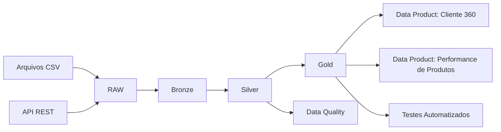
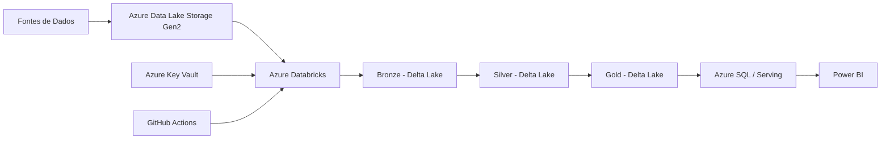

# Plataforma Integrada de Dados


Projeto de portfólio de **Engenharia de Dados** que simula uma plataforma integrada para ingestão, processamento, qualidade e disponibilização de dados para consumo analítico.

A solução integra dados provenientes de **arquivos CSV** e de uma **API REST**, processando-os com **Python e PySpark** por meio da arquitetura Medallion (**Bronze, Silver e Gold**).

---

## Objetivo

Simular um cenário no qual dados de clientes, vendas e fontes externas precisam ser integrados, tratados e transformados em produtos de dados confiáveis para apoiar análises de negócio.

O projeto demonstra práticas relacionadas a:

- Python
- PySpark
- SQL
- APIs REST
- Arquitetura Medallion
- Data Quality
- Testes automatizados
- Orquestração de pipelines
- Git e GitHub
- GitHub Actions
- Conceitos de Data Mesh
- Arquitetura de dados em Cloud

---

## Arquitetura



### RAW

Área de entrada dos dados provenientes das fontes.

Fontes utilizadas:

- Clientes em CSV
- Vendas em CSV
- Usuários obtidos por API REST

### Bronze

Primeira camada da arquitetura Medallion.

Responsável por centralizar os dados ingeridos preservando sua estrutura próxima à origem.

### Silver

Camada responsável pelo tratamento e padronização.

Entre as transformações realizadas:

- Remoção de duplicidades
- Validação de campos obrigatórios
- Conversão de tipos
- Padronização de textos
- Tratamento de e-mails
- Validação de quantidades e valores
- Conversão de datas
- Cálculo do valor total das vendas

### Gold

Camada orientada ao consumo analítico e às necessidades do negócio.

Foram criados dois Data Products principais.

#### Cliente 360

Consolida indicadores por cliente:

- Total de compras
- Receita total
- Ticket médio
- Última compra
- Segmentação

Segmentos utilizados:

- VIP
- Regular
- Ocasional

#### Performance de Produtos

Consolida:

- Unidades vendidas
- Total de vendas
- Receita total
- Quantidade de clientes únicos

---

## Ingestão via API

O projeto realiza uma ingestão de dados utilizando uma API REST pública.

Fluxo:

```text
API REST
   ↓
Requests
   ↓
Pandas
   ↓
RAW
   ↓
Bronze
```

A fonte externa utilizada no projeto é a API JSONPlaceholder.

---

## Data Quality

A solução possui validações automatizadas para verificar a qualidade dos dados processados.

Exemplos:

- `cliente_id` não pode ser nulo
- `cliente_id` deve ser único
- `email` não pode ser nulo
- `venda_id` não pode ser nulo
- `venda_id` deve ser único
- `quantidade` deve ser positiva
- `valor_unitario` deve ser positivo
- `valor_total` deve ser positivo

---

## Testes automatizados

O projeto utiliza **pytest** para validar os Data Products da camada Gold.

Entre os testes implementados:

- IDs de clientes não nulos
- Receita total positiva
- Segmentações dentro dos valores permitidos

Execução:

```bash
python -m pytest -v
```

---

## Orquestração

O pipeline completo pode ser executado por um único script:

```bash
python orchestration/executar_pipeline.py
```

O orquestrador executa sequencialmente:

```text
Ingestão API
    ↓
Bronze
    ↓
Silver
    ↓
Gold
    ↓
Data Quality
```

Uma falha em uma das etapas interrompe a execução, evitando que as etapas seguintes sejam processadas sobre uma camada inválida.

---

## SQL

O diretório `sql/` contém consultas analíticas propostas para consumo dos Data Products da camada Gold.

Exemplos de análises:

- Clientes com maior receita
- Clientes VIP
- Receita por cidade
- Performance dos produtos
- Produto com maior receita
- Receita por segmento

> As consultas fazem parte da camada analítica do projeto e não representam uma implantação de banco SQL em produção.

---

## CI com GitHub Actions

O projeto possui um workflow em:

```text
.github/workflows/ci.yml
```

A cada `push` ou `pull request` para a branch `main`, o GitHub Actions:

1. Baixa o código
2. Configura o Python
3. Instala as dependências
4. Executa os testes automatizados

Isso permite detectar regressões automaticamente durante a evolução do projeto.

---

## Data Mesh

O projeto também documenta princípios de **Data Mesh**, organizando o cenário em domínios de negócio.

Domínios simulados:

```text
Clientes
Vendas
Produtos
```

Os datasets produzidos na camada Gold são tratados como produtos de dados orientados ao negócio.

Exemplos:

- **Cliente 360**
- **Performance de Produtos**

Esta implementação é uma aplicação conceitual dos princípios de Data Mesh em um projeto de portfólio, e não uma implementação organizacional distribuída completa.

---

## Arquitetura equivalente em Azure

A implementação prática deste repositório é local e utiliza ferramentas gratuitas.

Em um cenário de produção, a arquitetura poderia ser evoluída para:



| Implementação local | Possível equivalente em Azure |
|---|---|
| Arquivos locais | Azure Data Lake Storage Gen2 |
| PySpark local | Azure Databricks |
| CSV Bronze/Silver/Gold | Delta Lake / Parquet |
| Scripts SQL | Azure SQL / SQL Warehouse |
| GitHub Actions | Pipeline de CI/CD |
| Variáveis de ambiente | Azure Key Vault |

> Azure e Databricks são apresentados como arquitetura-alvo para produção. Este projeto não afirma possuir um deployment real nesses serviços.

---

## Estrutura do projeto

```text
plataforma-integrada-dados/
│
├── .github/
│   └── workflows/
│       └── ci.yml
│
├── architecture/
│   └── arquitetura.md
│
├── data/
│   ├── raw/
│   ├── bronze/
│   ├── silver/
│   └── gold/
│
├── orchestration/
│   └── executar_pipeline.py
│
├── sql/
│   └── analises_negocio.sql
│
├── src/
│   ├── ingestion/
│   ├── bronze/
│   ├── silver/
│   ├── gold/
│   └── quality/
│
├── tests/
│   └── test_gold.py
│
├── .gitignore
├── requirements.txt
└── README.md
```

---

## Tecnologias

| Tecnologia | Aplicação |
|---|---|
| Python 3.11 | Desenvolvimento do pipeline |
| PySpark 3.5 | Processamento distribuído |
| Pandas | Persistência e manipulação auxiliar |
| Requests | Consumo da API REST |
| SQL | Consultas analíticas |
| pytest | Testes automatizados |
| Git | Versionamento |
| GitHub | Repositório remoto |
| GitHub Actions | Integração contínua |

---

## Como executar

### 1. Clonar o projeto

```bash
git clone https://github.com/igorkaynan/plataforma-integrada-dados.git
cd plataforma-integrada-dados
```

### 2. Criar ambiente virtual

```bash
python -m venv .venv
```

No Windows PowerShell:

```powershell
.\.venv\Scripts\Activate.ps1
```

### 3. Instalar dependências

```bash
pip install -r requirements.txt
```

### 4. Requisito para PySpark

Para execução local das etapas PySpark, é necessário possuir uma versão compatível do Java instalada e configurar `JAVA_HOME` quando necessário.

O ambiente utilizado durante o desenvolvimento foi:

- Python 3.11
- PySpark 3.5.6
- Java 17

### 5. Executar o pipeline completo

```bash
python orchestration/executar_pipeline.py
```

### 6. Executar testes

```bash
python -m pytest -v
```

---

## Decisões de arquitetura

O projeto foi desenvolvido localmente para manter o ambiente de estudo e portfólio sem dependência de infraestrutura Cloud paga.

Para simplificar a compatibilidade do ambiente Windows, os resultados das camadas são persistidos em CSV. Em uma arquitetura de produção, a evolução natural seria utilizar formatos como **Delta Lake** ou **Parquet** em um Data Lake.

Essa separação permite demonstrar os conceitos de engenharia de dados sem afirmar experiência prática com serviços Cloud que não foram efetivamente implantados neste projeto.

---

## Possíveis evoluções

- Implantação real em Azure
- Azure Databricks e Delta Lake
- Databricks Workflows ou Azure Data Factory
- Integração com fonte NoSQL/MongoDB
- Observabilidade e métricas do pipeline
- Catálogo e governança de dados
- Testes adicionais de transformação
- Continuous Deployment para um ambiente Cloud

---

## Resultado

O projeto implementa um pipeline funcional de ponta a ponta:

```text
CSV + API REST
      ↓
     RAW
      ↓
   BRONZE
      ↓
   SILVER
      ↓
    GOLD
      ↓
DATA PRODUCTS
      ↓
DATA QUALITY + TESTES
```

Com versionamento em Git, integração contínua no GitHub Actions e documentação de uma possível evolução para uma arquitetura moderna de dados em Azure.
