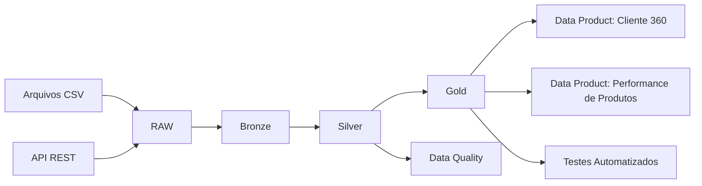

# Arquitetura da Plataforma Integrada de Dados

## Visão Geral

A Plataforma Integrada de Dados foi desenvolvida para simular uma arquitetura moderna de engenharia de dados utilizando boas práticas de ingestão, tratamento, qualidade e disponibilização de dados.

O fluxo principal segue o padrão de arquitetura Medallion:

RAW → Bronze → Silver → Gold

## Fluxo de Dados

